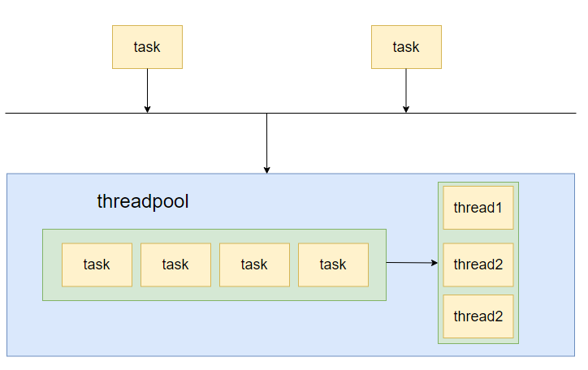

# Some exercise of multithread programming


# basic

## create_thread

some basic usage

## mutex

1. single mutex, but sometimes throw error between the mutex lock and unlock, which may deadlock in other thread, solved by 2.
2. RAII, `std::lock_guard`, can not manually unlock, solved by 3.
3. RAII, `std::unique_lock`, only manage one mutext, solved by 4.
4. RAII, `std::scope_lock`

## con_variable

One empty loop cause much cpu resource.

In producer and consumer model, cpu cause much.

1. `std::this_thread::sleep_for`
2. `std::condition_variable`

## semaphore

## promise && future

promise and future is used to pass the data in different thread, when passing pointer is sometimes dangerous
  
usage: thread 1 -> thread 2, thread initialize promise and future, and pass promise to thread, it is the promise from thread 2 to thread 1, future is the result or accept the promise of thread 2, than thread 1 use the future to get the value from the thread 2.

sometimes we need to pass the data to multiple thread from current (after it the data has value), then use `std::share_future`

## async

`std::thread` is not provided the method to get the child thread function return value, we do this cost lot(create thread, join, wait child thread finish)

`std::async` automaticlly finish it

# producer && consumer

A example from [cppreference](https://en.cppreference.com/w/cpp/thread/condition_variable/wait).

```cpp
void waits() {
  std::unique_lock<std::mutex> lk(cv_m);
  std::cerr << "Waiting... \n";
  cv.wait(lk, [] { return i == 1; });
  std::cerr << "...finished waiting. i == 1\n";
}

void signals() {
  std::this_thread::sleep_for(std::chrono::seconds(1));
  {
    std::lock_guard<std::mutex> lk(cv_m);
    std::cerr << "Notifying...\n";
  }
  cv.notify_all();

  std::this_thread::sleep_for(std::chrono::seconds(1));

  {
    std::lock_guard<std::mutex> lk(cv_m);
    i = 1;
    std::cerr << "Notifying again...\n";
  }
  cv.notify_all();
}
```

1. spurious wakeup. `If` that warrp the `wait` chage to `While`. 
2. lost wakeup. the notification gets lost if the sender sends its notification before the receiver gets to a wait state. (sender's notification is invalid, it wake up nobody).

## ref

1. https://www.modernescpp.com/index.php/condition-variables/

# threadpool

a simple thread pool

