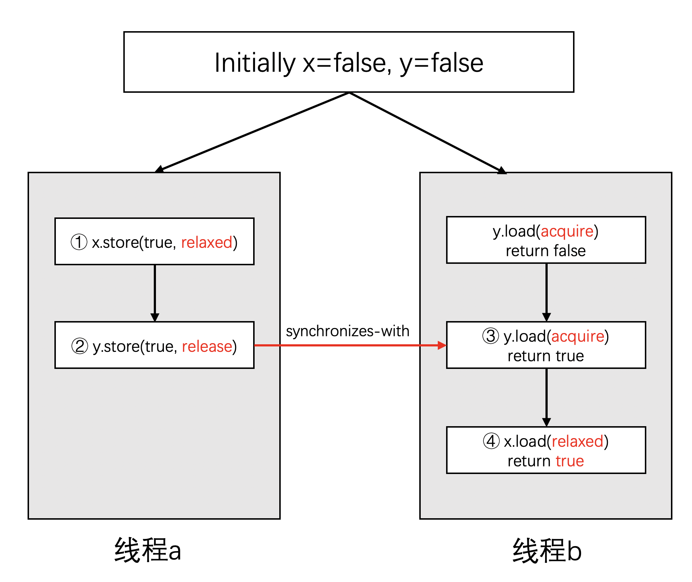

这六种内存约束符从读/写的角度进行划分的话，可以分为以下三种：

- 读操作(memory_order_acquire memory_order_consume)
- 写操作(memory_order_release)
- 读-修改-写操作(memory_order_acq_rel memory_order_seq_cst)

举例来说，因为store是一个写操作，当调用store时，指定memory_order_relaxed或者memory_order_release或者memory_order_seq_cst是有意义的。而指定memory_order_acquire是没有意义的。

- synchronized-with，`synchronized-with` 
- sequenced-before，单线程情况下的 `happens-before`，a 的执行在 b 之前，且 a 执行后的结果 b 也能看到
- happens-before，操作 a `happens-before` 操作 b，则操作 a 的结果对于操作 b 可见，可以是单线程之间，也可以多线程两个操作之间
- inter-thread-happens-before，多线程情况下的 `happens-before`

# std::memory_order_relaxed

1. 多线程同一个原子变量不具有 `synchronized-with` 
2. 单线程同一个原子变量具有 `happens-before`，不同原子变量不具有 `happens-before`，可以乱序执行

- 尽管所有操作都是原子的，但是所有的事件不要求存在一个全局顺序
- 同一个线程内部有happens-before规则，但是线程之间可能会看到不同的顺序

# std::memory_order_seq_cst

全局一致性协议

# acquire-release

对原子变量的 load 使用 memory_order_acquire，成为 acquire 操作
对原子变量的 store 使用 memory_order_release，成为 release 操作
memory_order_acq_rel，同时为二者


acq-rel 模型有如下保证：

- 同一个对象上的原子操作不允许被乱序。
- release 操作禁止了所有在它之前的读写操作与在它之后的写操作乱序。
- acquire 操作禁止了所有在它之前的读操作与在它之后的读写操作乱序。

```cpp
std::atomic<bool> x, y;
std::atomic<int> z;

void write_x_then_y() {
  x.store(true, std::memory_order_relaxed);  // ①
  y.store(true, std::memory_order_release);  // ②
}

void read_y_then_x() {
  while (!y.load(std::memory_order_acquire))
    ;                                          // ③
  if (x.load(std::memory_order_relaxed)) ++z;  // ④
}

int main() {
  x = false;
  y = false;
  z = 0;
  std::thread a(write_x_then_y);
  std::thread b(read_y_then_x);
  a.join();
  b.join();
  assert(z.load() != 0);  // ⑤
}
```



# std::atomic_thread_fence

在线程间进行数据访问的同步

# ref

1. [C++ 并发编程(11) 原子操作和内存模型](https://www.bilibili.com/video/BV1m84y1d7rS)
2. [C++ 内存模型](https://paul.pub/cpp-memory-model/)
3. [通过内存顺序实现内存模型](https://gitbookcpp.llfc.club/sections/cpp/concurrent/concpp12.html)
4. [聊聊内存模型和内存序](https://cloud.tencent.com/developer/article/2026043)